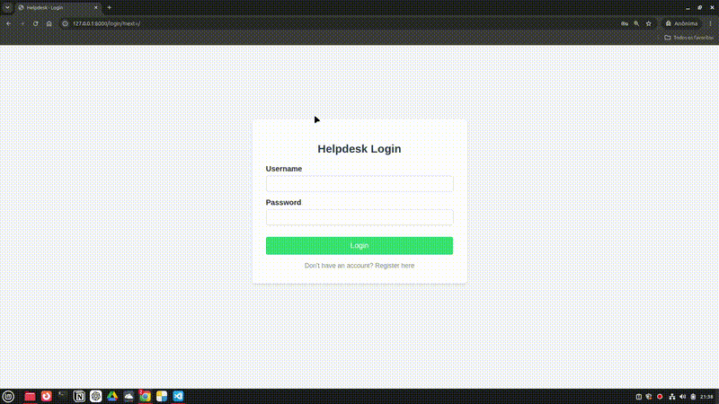

Helpdesk App
A lightweight and secure Helpdesk Ticket Management System built with Python and Django. This project demonstrates a complete CRUD cycle integrated with Django's native authentication system and dynamic data filtering.

Features
User Authentication: Complete secure registration, login, and logout flows.

Data Isolation: Users can only view, create, update, or delete their own tickets.

Dynamic Dashboard Filters: Fast filtering by ticket status (Open, In Progress, Resolved) directly from the dashboard.

Full CRUD Operations: Structured handling of priority levels and custom statuses.

## Demo

Tech Stack
Backend: Python 3.12+ / Django 5.x

Database: SQLite (Development environment)

Frontend: HTML5 / CSS3 (Clean and responsive custom styling)

Installation & Setup
Clone the repository:
git clone https://github.com/alexandre-dev-master/helpdesk-app.git
cd helpdesk-app

Create and activate a virtual environment:
python3 -m venv venv
source venv/bin/activate  # On Windows use: venv\Scripts\activate

Install dependencies:
pip install -r requirements.txt

Run database migrations:
python manage.py migrate

Create a superuser (Admin panel access):
python manage.py createsuperuser

Start the development server:
python manage.py runserver

Access the application at http://127.0.0.1:8000/
